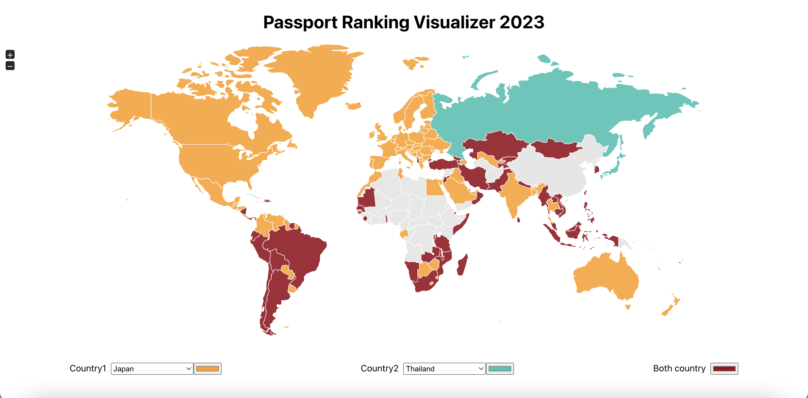

# Passport Ranking Visualizer

This project visualizes passport ranking data on map.  
By selecting contry1 and country2, you can see which country passport holder from each selected country can go without visa.

## Technology Stacks

## Motivation

I wanted to know which country I can go without visa, and compare between two countries to find out differences.  
Seeing the differences, it might be helpfull to understand the international relationships between countries.

## What I learn

This is my first React project.  
I have learned basic knowledge of React and how to use state.

## Future Improvements

Grabbing data from backend server.
